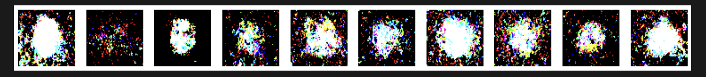

# Diffusion Generator for T-shirt Graphic Designs

## Best Generated / Representative image from Diffusion Model



> **Learnings**: I could not get actual graphical designs to be generated from that tattoo dataset. The image dataset did not contain enough images (currently at ~4.24K images) and varied considerably from image to image in terms of color, design, shapes, etc.

## Business Goal / Case Statement

Accelerate and Innovate T-shirt Graphic Design Through AI.

## Assignment Context

**Relevant Industry and/or Business Function:** Fashion / Apparel Design / E-commerce

**Description:**

My goal is to revolutionize custom t-shirt graphic creation by developing a diffusion model trained on a curated dataset of tattoo-inspired artwork. This model will generate high-impact, stylized visuals optimized for apparel, offering a scalable and efficient alternative to traditional design workflows.

The output will serve as a continuous source of original t-shirt graphics, addressing three major pain points in the industry:

1. Accelerating design timelines by reducing design-to-market cycles from weeks to days through automated generation of unique visuals.

2. Cutting costs while scaling creativity by lowering dependency on expensive human designers and decreasing design production costs (estimated at up to 40%).

3. Enhancing brand differentiation and engagement by offering customers on-demand, AI-personalized design options, which may boost engagement, loyalty, and conversion rates.

Initially, this T-shirt Graphic Design Generator will function as a rapid ideation tool for in-house creative teams. By combining premium, dark-colored t-shirt manufacturing with uniquely stylized, AI-generated graphics, my goal is to establish a trusted fashion brand known for defining go-to night-out apparel for men.

By accelerating the discovery of both trending and original designs, the tool enables fashion brands to respond to consumer demand with greater speed and accuracy—streamlining production while strengthening market relevance.

## Quickstart

1. **Create a New Conda Environment**

```bash
conda create -n myenv python=3.10
```

2. **Activate the Environment**

```bash
conda activate myenv
```

3. **Install `pip` and `ipykernel`**

```bash
conda install pip ipykernel
```

4. **Install Requirements**

```bash
pip install -r requirements.txt
```

5. **Run the notebook**

  * In VSCode, select the kernel for your notebook:

    * Click on "Select Kernel" in the top right of the notebook

    * Choose your virtual environment
